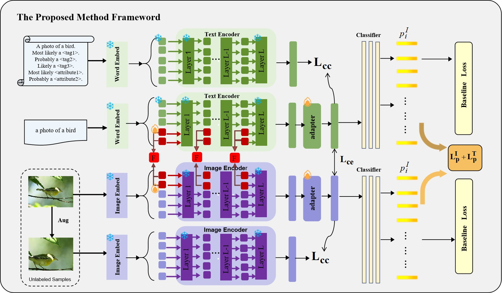

# DCMP: Dual-consistency Cross-modal Prompting for Open-World Semi-Supervised Learning




This repository contains only the main DCMP training and evaluation pipeline. Ablation and hyperparameter-sensitivity scripts/options are intentionally excluded.

## Requirements

```bash
pip install -r requirements.txt
```

## Data

The released code supports **CUB**, **Stanford Cars**, **Flowers102**, **CIFAR-10**, and **CIFAR-100**. Put the datasets under `./datasets` or set the corresponding environment variables in `config.py`.

DCMP uses retrieval-based textual descriptions as input. Prepare the description files following the TextGCD-style retrieval pipeline and place them in `./retrieved_text` with the following names:

```text
cub_retrieved_text.npy
scars_retrieved_text.npy
flowers_retrieved_text.npy
cifar10_retrieved_text.npy
cifar100_retrieved_text.npy
```

## Training

```bash
bash scripts/train.sh cub 1
```

or

```bash
python train.py --dataset_name cub --seed 1
```

The public release fixes the model and loss settings to the final configuration reported in the paper (prompt length 4, prompt depth 12, dual cosine consistency, and equal image-text voting).

## Evaluation

```bash
bash scripts/eval.sh cub /path/to/best_model.pth
```

## Notes

The pre-trained CLIP image/text encoders remain frozen. DCMP optimizes the textual prompts, text-to-visual prompt projections, image/text adapters, and classification heads. At inference, the final prediction is obtained by summing the image-branch and text-branch probability distributions.

## Acknowledgement

This codebase is built upon the implementation of TextGCD. We sincerely thank the authors of TextGCD for their excellent work and for providing the codebase that served as the foundation for this project.

H. Zheng, N. Pu, W. Li, N. Sebe, and Z. Zhong, "Textual Knowledge Matters: Cross-Modality Co-Teaching for Generalized Visual Class Discovery," European Conference on Computer Vision (ECCV), 2024.

If you use this repository, please also consider citing TextGCD.

## Citation

If you find DCMP useful in your research, please cite our paper. Citation information will be updated after publication.
